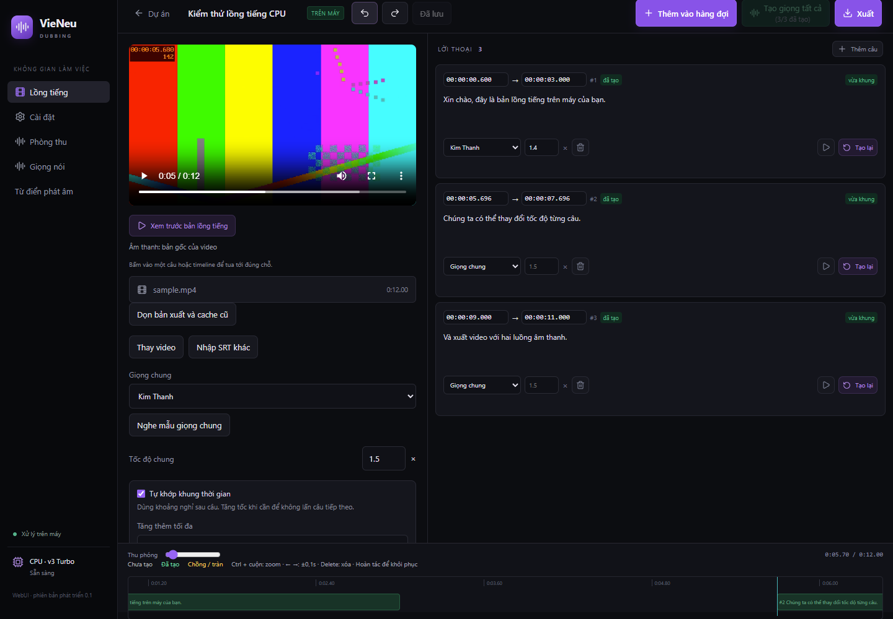
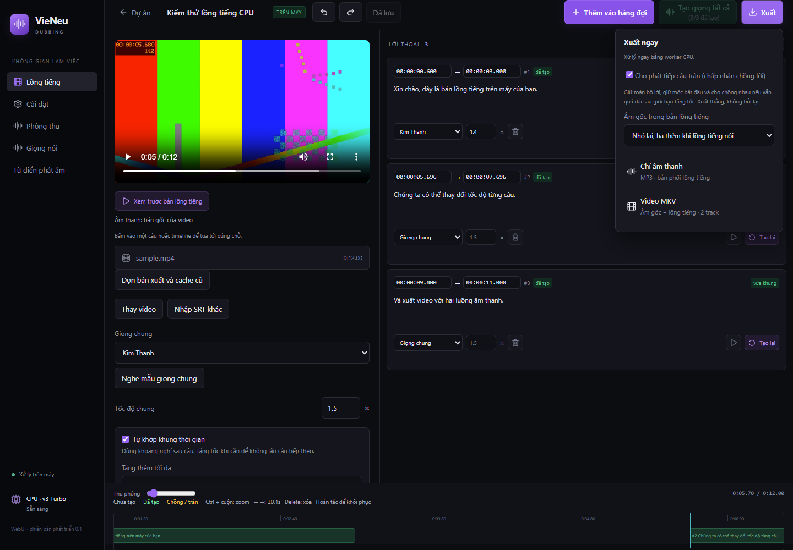
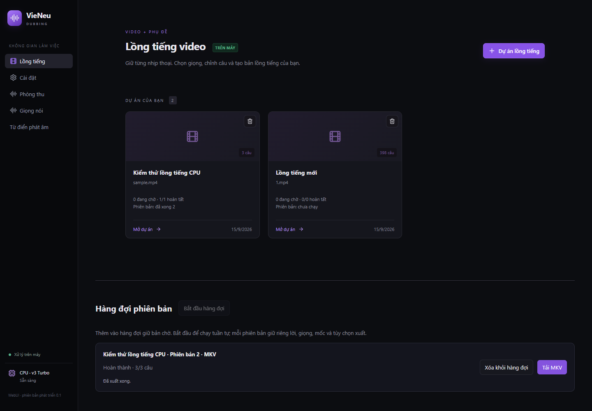
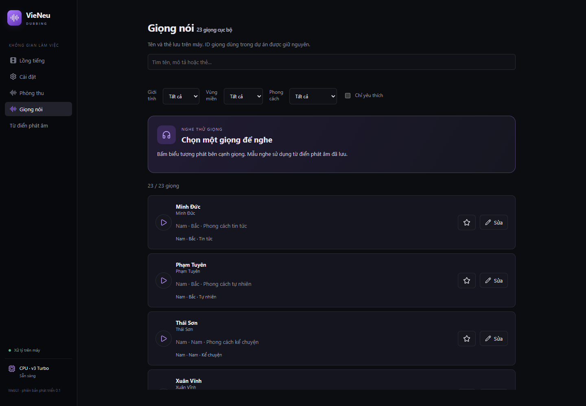
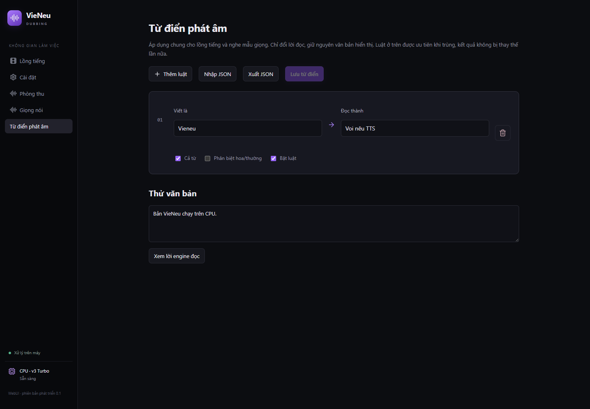
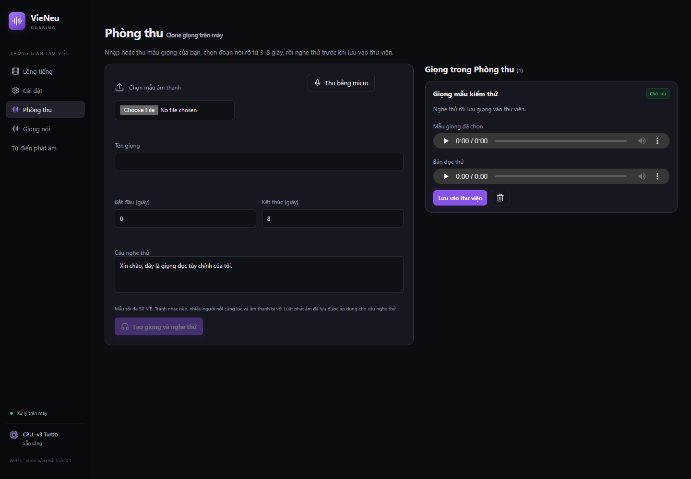

# VieNeu Dubbing

WebUI lồng tiếng tiếng Việt chạy cục bộ: nhập **video + SRT**, tạo giọng theo mốc thời gian và xuất **MP3** hoặc **MKV có hai audio track**. Có thư viện giọng, từ điển phát âm, hàng đợi phiên bản và Phòng thu clone giọng.

Dự án dựa trên bộ công cụ [VieNeu-TTS](https://github.com/pnnbao97/VieNeu-TTS). Phần WebUI và quy trình lồng tiếng được phát triển riêng. Thông tin giấy phép được giữ trong [LICENSE](LICENSE).

## Chức năng

### Lồng tiếng và timeline



- Nhập video và phụ đề SRT sẵn có; sửa lời, chọn giọng chung hoặc từng câu.
- Giữ mốc bắt đầu, dùng khoảng nghỉ phía sau, tăng tốc trong giới hạn; báo câu tràn/chồng lời.
- Sửa mốc trực tiếp, kéo câu trên timeline, nghe trước bản gốc hoặc bản lồng tiếng.
- **Ctrl + lăn chuột** trong timeline: zoom 1–20×, giữ vị trí gần con trỏ.
- Chọn câu trên timeline rồi bấm **← / →**: dời 0,1 giây; **Delete**: xóa. Dùng Hoàn tác để khôi phục.
- Phím chỉ tác động khi focus ở timeline; không chiếm phím trong ô nhập, trình phát video hoặc các trang khác.
- Màu xám: chưa tạo; xanh: đã tạo; vàng: tràn/chồng lời.

### Xuất âm thanh và video



- **MP3:** bản phối lời lồng tiếng và âm gốc theo lựa chọn.
- **MKV:** đúng hai audio tracks: Original và Vietnamese Dub. Hình ảnh remux bằng mkvmerge, không encode lại video.
- Âm gốc: nhỏ lại và duck khi có lời, giữ nguyên và duck, giữ nguyên hoàn toàn, rất nhỏ hoặc tắt.
- Chọn giữ câu tràn (chấp nhận chồng nhau) hoặc bỏ qua câu đó trước khi xuất.
- Video không có audio gốc vẫn xuất MP3; MKV hai track cần có audio gốc. Nhiều audio gốc: chọn một track để giữ.

### Hàng đợi phiên bản và nguồn cục bộ



- **Thêm vào hàng đợi** lưu bản chờ; **Tạo giọng tất cả / Xuất** xử lý ngay hoặc chờ worker đang bận.
- Mỗi phiên bản giữ snapshot riêng của nội dung, giọng và lựa chọn xuất.
- Bắt đầu, dừng, thử lại, chỉnh sửa về dự án gốc, xóa riêng phiên bản.
- Nguồn có thể upload hoặc chọn từ thư mục server được mount chỉ đọc qua `APP_MEDIA_ROOT`.

### Thư viện giọng



Tìm/lọc, đánh dấu yêu thích, nghe mẫu, sửa tên/mô tả/thẻ. Giọng custom tạo trong Phòng thu cũng dùng được trong lồng tiếng.

### Từ điển phát âm



Luật đã lưu áp dụng cho mọi dự án và các lần tạo/nghe giọng tiếp theo. Văn bản hiển thị không đổi. Hỗ trợ cả từ, phân biệt hoa thường, bật/tắt, nhập/xuất JSON. Phiên bản đã đưa vào hàng đợi giữ bản luật lúc tạo.

### Phòng thu



Nhập file hoặc thu micro, chọn mẫu **3–8 giây**, clone trên CPU, nghe thử và lưu giọng custom. Có hủy/thử lại; chặn xóa giọng đang được dự án/queue sử dụng. Micro cần localhost hoặc HTTPS. [Hướng dẫn và giới hạn kiểm chứng](docs/STUDIO.vi.md).

## Chạy nhanh bằng Docker Compose

Image Linux `amd64`, ONNX CPU, v3 Turbo fp32. **GPU chưa được hỗ trợ trong WebUI này**; thêm `--gpus all` không làm worker chuyển sang GPU. Không dùng các Dockerfile/Compose GPU cũ của SDK cho ứng dụng này.

```bash
git clone https://github.com/NgoMinhToan/vienue-dubbing.git
cd vienue-dubbing
docker compose pull
docker compose up -d
docker compose logs -f
```

Mở **http://127.0.0.1:7861**. File `compose.yaml` ở thư mục gốc giữ dữ liệu trong named volume `dubbing_data` và mount thư mục hiện hành vào `/media` chỉ đọc.

### Compose: tùy chọn cổng, nguồn video và dung lượng

Tạo `.env` cạnh `compose.yaml`:

```dotenv
IMAGE_TAG=latest
HOST_PORT=8080
BIND_ADDRESS=127.0.0.1
MEDIA_DIR=/srv/videos
APP_MAX_VIDEO_BYTES=10737418240
APP_MIN_FREE_BYTES=1073741824
```

Windows Docker Desktop: thay `MEDIA_DIR=/srv/videos` bằng `MEDIA_DIR=D:/Videos`.

```bash
docker compose up -d
# Mở http://127.0.0.1:8080
docker compose stop
docker compose start
```

### Compose: bind mount dữ liệu sang thư mục riêng

Tạo `compose.bind.yaml` cạnh `compose.yaml`:

```yaml
services:
  dubbing:
    volumes:
      - type: bind
        source: ${DATA_DIR}
        target: /data
```

Compose thay mount có cùng target `/data`, giữ mount `/media` từ file gốc.

```bash
mkdir -p /srv/vienue-data
sudo chown -R 1000:1000 /srv/vienue-data
DATA_DIR=/srv/vienue-data docker compose -f compose.yaml -f compose.bind.yaml up -d
```

PowerShell:

```powershell
New-Item -ItemType Directory -Force D:/VieNeuData | Out-Null
$env:DATA_DIR = 'D:/VieNeuData'
docker compose -f compose.yaml -f compose.bind.yaml up -d
```

## Docker run

### Cơ bản: dữ liệu bền vững bằng named volume

```bash
docker run -d --name vienue-dubbing --restart unless-stopped -p 127.0.0.1:7861:7861 -v vienue_data:/data ghcr.io/ngominhtoan/vienue-dubbing:latest
```

### Mount dữ liệu và video riêng trên Linux

```bash
mkdir -p /srv/vienue-data /srv/videos
sudo chown -R 1000:1000 /srv/vienue-data
docker run -d --name vienue-dubbing --restart unless-stopped -p 127.0.0.1:7861:7861 --mount type=bind,source=/srv/vienue-data,target=/data --mount type=bind,source=/srv/videos,target=/media,readonly -e APP_MEDIA_ROOT=/media ghcr.io/ngominhtoan/vienue-dubbing:latest
```

Container chạy UID 1000; `/data` cần quyền ghi, `/media` chỉ cần quyền đọc. Chỉ nhập file từ `/media` không sửa/xóa bản nguồn.

### Windows Docker Desktop (Linux containers)

```powershell
New-Item -ItemType Directory -Force D:/VieNeuData,D:/Videos | Out-Null
docker run -d --name vienue-dubbing --restart unless-stopped -p 127.0.0.1:7861:7861 --mount type=bind,source=D:/VieNeuData,target=/data --mount type=bind,source=D:/Videos,target=/media,readonly -e APP_MEDIA_ROOT=/media ghcr.io/ngominhtoan/vienue-dubbing:latest
```

### Cổng, cache model, thư mục tạm và giới hạn upload riêng

```bash
docker run -d --name vienue-custom -p 127.0.0.1:8080:8080 -v vienue_data:/data -v vienue_models:/models -v vienue_tmp:/worktmp -e APP_HOST=0.0.0.0 -e APP_PORT=8080 -e HF_HOME=/models -e APP_TEMP_DIR=/worktmp -e APP_MAX_VIDEO_BYTES=10737418240 -e APP_MIN_FREE_BYTES=1073741824 ghcr.io/ngominhtoan/vienue-dubbing:latest
```

Các volume tách riêng phải ghi được bởi UID 1000. Với named volume mới cho `/models` và `/worktmp`, chuẩn bị quyền trước:

```bash
docker run --rm --user 0 -v vienue_models:/models -v vienue_tmp:/worktmp --entrypoint chown ghcr.io/ngominhtoan/vienue-dubbing:latest -R 1000:1000 /models /worktmp
```

Chạy lệnh chuẩn bị quyền trước lệnh khởi động nếu volume chưa có quyền ghi.

### Build image từ mã nguồn

```bash
docker build -f docker/Dockerfile.dubbing -t vienue-dubbing:local .
docker run --rm -p 127.0.0.1:7861:7861 -v vienue_data:/data vienue-dubbing:local
```

## Biến môi trường

Image và Compose đã đặt mặc định; không bắt buộc tạo `.env` để chạy cơ bản.

| Biến | Mặc định trong image / Compose | Ý nghĩa |
|---|---|---|
| `APP_HOST` | `0.0.0.0` | Địa chỉ lắng nghe trong container; giữ giá trị này để port mapping hoạt động |
| `APP_PORT` | `7861` | Cổng bên trong; thay đổi phải sửa vế phải của `-p` |
| `APP_DATA_DIR` | `/data` | Dự án, SQLite, giọng custom, mẫu nghe và bản xuất; cần mount bền vững |
| `APP_TEMP_DIR` | `/data/tmp` | File xử lý tạm; cần quyền ghi |
| `HF_HOME` | `/data/models` | Cache model; lần đầu cần mạng tải model |
| `APP_MEDIA_ROOT` | `/app` trong image; `/media` trong Compose | Root duyệt file nguồn; mount thư mục host vào đây |
| `APP_MAX_VIDEO_BYTES` | `21474836480` | Giới hạn upload video: 20 GiB |
| `APP_MIN_FREE_BYTES` | `536870912` | Dung lượng trống tối thiểu khi nhập video: 512 MiB; xử lý còn kiểm tra dung lượng dự phòng riêng |
| `FFMPEG_BIN`, `FFPROBE_BIN`, `MKVMERGE_BIN` | Tìm trên PATH | Override executable khi cài công cụ ở vị trí riêng; image đã có đủ |
| `HF_HUB_OFFLINE` | Không đặt | Đặt `1` khi đã tải đủ model để chạy offline; thiếu cache sẽ báo lỗi |
| `HF_TOKEN` | Không đặt | Tùy chọn cho Hugging Face; không bắt buộc với model public, không ghi token vào Git |
| `PYTHONUTF8`, `PYTHONUNBUFFERED` | `1` | Unicode và log Python trong container |

Biến chỉ dành cho file Compose: `IMAGE_TAG=latest`, `HOST_PORT=7861`, `BIND_ADDRESS=127.0.0.1`, `MEDIA_DIR=.`. `DATA_DIR` chỉ dùng cho override bind mount ở ví dụ trên.

Chỉ có một instance worker/server trên cùng data volume. Không chạy nhiều replica chung SQLite. Các ví dụ bind cổng vào localhost; triển khai domain/auth chưa thuộc phạm vi bản này.

## Cập nhật và sao lưu

```bash
docker compose pull
docker compose up -d
docker compose logs --tail 100
```

Dừng container trước khi sao lưu toàn bộ `/data`. Không dùng `docker compose down -v` nếu muốn giữ named volume. Image không chứa dữ liệu người dùng hoặc model đã tải.

`latest` được cập nhật sau khi commit `main` vượt test Windows/Linux và Docker smoke. Có thêm tag `edge`, SHA đầy đủ và phiên bản khi tạo release. Muốn cố định bản chạy, dùng tag SHA hoặc digest thay `latest`.

## Chạy trực tiếp trên Windows

Trong thư mục dự án, chạy `Setup.ps1`, sau đó `Start.bat`. Cần Python/runtime và các công cụ được trình cài hướng dẫn. Ứng dụng mặc định mở ở `127.0.0.1:7861`; dữ liệu mặc định tại `data/`. Hướng dẫn chi tiết: [README-DUBBING.vi.md](README-DUBBING.vi.md).

## Phạm vi và kiểm thử

Không nhận diện lời thoại, dịch, sách nói, dựng video AI hoặc gọi dịch vụ TTS trả phí. GPU chưa hỗ trợ. Clone đã thử trên Windows CPU và offline từ giọng đã lưu; độ giống với giọng người thật, micro vật lý và clone thật trong Docker/Linux vẫn cần nghiệm thu thêm.

```bash
python -m pytest tests/dubbing -q
cd frontend
npm install
npm run build
```

Xem [kế hoạch](docs/EXECUTION_PLAN.vi.md), [CHANGELOG](CHANGELOG.md) và [thay đổi lịch sử Git](docs/GIT_HISTORY.vi.md).
